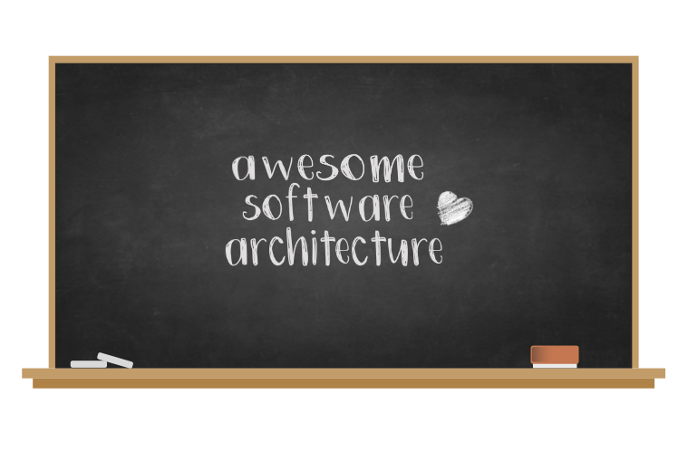

# Awesome Software Architecture 
  

  
[Software architecture](https://en.wikipedia.org/wiki/Software_architecture) aims to describe the high level 
structures of software as well as the discipline of creating them. As this topic is pretty broad, it might 
contain some resources that are also present in more niche lists. 
  

## Contents

- [Design Patterns](#design-patterns)
- [Methodology](#methodology)
- [Documentation](#documentation)
- [Workshop formats](#workshop-formats)
- [Modeling](#modeling)
- [Tools](#tools)
- [Frameworks](#frameworks)
  - [Agile](#agile)
  - [Lean software development](#lean-software-development)
  - [Extreme programming](#extreme-programming)
  - [DevOps](#devops)
- [Bonus](#bonus)

## Design Patterns
- [Ports and adapters pattern](https://softwarecampament.wordpress.com/portsadapters/) - Decouple the application core logic from the services it uses.
- [Observer pattern](https://medium.com/datadriveninvestor/design-patterns-a-quick-guide-to-observer-pattern-d0622145d6c2) - One-to-many state change notification.
- [Design Patterns: Elements of Reusable Object-Oriented Software, by Gamma et al](https://www.amazon.com/Design-Patterns-Elements-Reusable-Object-Oriented/dp/0201633612/) - The one that started it all :orange_book:.
- [Software Design Patterns: A Guide](https://airbrake.io/blog/design-patterns/software-design-patterns-guide) - Introduction to common software design patterns.
- [Software Design Patterns and Principes (quick overview)](https://www.youtube.com/watch?v=WV2Ed1QTst8) - Reasons about common design patterns as well as their upsides and downsides 🎥.
- [CQRS](https://docs.microsoft.com/en-us/azure/architecture/patterns/cqrs) - Segregate operations that read data from operations that update data by using separate interfaces.
- [Event Sourcing](https://docs.microsoft.com/en-us/azure/architecture/patterns/event-sourcing) - Instead of storing just the current state of the data in a domain, use an append-only store to record the full series of actions taken on that data.
- [Feature Toggles](https://www.martinfowler.com/articles/feature-toggles.html) - Feature Toggles (often also refered to as Feature Flags) are a powerful technique, allowing teams to modify system behavior without changing code.
- [Behavior Driven Development (BDD) and Functional Testing](https://medium.com/javascript-scene/behavior-driven-development-bdd-and-functional-testing-62084ad7f1f2) - BDD uses human-readable descriptions of software user requirements as the basis for software tests.
- [N-tier architecture style](https://docs.microsoft.com/en-us/azure/architecture/guide/architecture-styles/n-tier) - Layers are a way to separate responsibilities and manage dependencies.

## Methodology

- [No silver bullet, by Brooks](http://worrydream.com/refs/Brooks-NoSilverBullet.pdf) - Making a case for growing software in small increments :orange_book:.
- [Clean Architecture, by Martin](https://www.amazon.com/Clean-Architecture-Craftsmans-Software-Structure/dp/0134494164) - Key principles and concepts for building sustainable and maintainable software :orange_book:.
- [Technical Debt, by Fowler](https://martinfowler.com/bliki/TechnicalDebt.html) - Cost and impact of accumulating technical debt.
- [The Magic Tricks of Testing, by Metz](https://www.youtube.com/watch?v=URSWYvyc42M) - Minimalistic ideals as a practical and pragmatic approach to software testing 🎥.
- [TDD, Where did it all go wrong?, by Cooper](https://www.infoq.com/presentations/tdd-original/) - Suggestion on TDD practices and boundaries to reduce coupling 🎥.

## Documentation

- [Architectural Decision Records](https://adr.github.io/) - Version and document architectural decisions the same way you do with code.
- [Documenting architecture](https://dzone.com/articles/documenting-architecture-1) - Pragmatic tips on how to effectively document software architecture.

## Workshop formats

- [Event Storming](https://www.eventstorming.com/) - Format for exploring domain driven-design.
- [MoSCoW Prioritization](https://www.knowledgehut.com/blog/agile/how-to-prioritise-requirements-with-the-moscow-technique) - Fast and dead-simple way of prioritizing requirements.
- [Story mapping](https://www.jpattonassociates.com/wp-content/uploads/2015/03/story_mapping.pdf) - Visualize your requirements by creating story maps.
- [Impact mapping](https://www.impactmapping.org/) - A strategic planning technique used for building products and delivering projects.
- [Business Model Canvas](https://en.wikipedia.org/wiki/Business_Model_Canvas) - Business plans made simple and visual.
- [Business Model Generation, by Osterwalder & Pigneur](https://www.amazon.com/Business-Model-Generation-Visionaries-Challengers/dp/0470876417) - Easily visualize your value proposition, costs and revenue streams :orange_book:.

## Modeling

- [The C4 Model](https://c4model.com/) - Describe software using Context, Containers, Components and Code.
- [Wikipedia: Data modeling](https://en.wikipedia.org/wiki/Data_modeling) - Great, short, introduction to data modeling.

## Tools

- [Sparx Systems Enterprise Architect](https://sparxsystems.com/products/ea/index.html) - Object-oriented modelling suite. Only available natively for Windows.
- [Visual Paradigm](https://www.visual-paradigm.com/) - Similar to Enterprise Architect. Available for multiple platforms.
- [Lucidchart](https://www.lucidchart.com) - Paid cloud-based diagram editor. Available on all common platforms.
- [Draw.io](https://www.draw.io) - Free and simple diagram editor. Comparable to Visio and its likes. Available on all common platforms.
- [Structurizr](https://structurizr.com) - Modelling tool based on the C4 Model (see above).
- [PlantUML](http://plantuml.com/) - Like markdown for diagrams, PlantUML renders an english-like grammer into diagrams.
- [PlantUML for Atlassian](https://marketplace.atlassian.com/apps/1215115/plantuml-for-confluence-cloud?hosting=cloud&tab=overview) - Adds support for PlantUML-based diagrams in the atlassian suite.

## Frameworks

### Agile

- [Scrum](https://www.scrumguides.org/) - Framework for developing and maintaining complex products.
- [SAFe](https://www.scaledagileframework.com/) - Scalable agile framework.
- [Nexus](https://www.scrum.org/resources/scaling-scrum) - Scalable Scrum according to Ken Schwaber, co-creator of Scrum. 
- [The death of Agile, by Allen Holub](https://www.youtube.com/watch?v=HZyRQ8Uhhmk&feature=youtu.be) - How "Agile" has moved away from the basic principles of agility, and what we need to do to fix things 🎥.
- [Agile Architecture Pt. 1, by Allen Holub](https://www.youtube.com/watch?v=0kRCFVGpX7k) - How do we work with architecture in a agile world 🎥. 
- [Agile Architecture Pt. 2, by Allen Holub](https://www.youtube.com/watch?v=txbS0WJC1bo) - How do we work with architecture in a agile world 🎥. 
### Lean software development

- [Wikipedia: Lean Software Development](https://en.wikipedia.org/wiki/Lean_software_development) - Translation of lean manufacturing for the software development domain.
- [Rolling rocks downhill, by Clarke Ching](https://www.amazon.com/Rolling-Rocks-Downhill-Software-Projects/dp/1505446511) - Business novel about agile and lean software development :orange_book:.
- [The Goal: A Process of Ongoing Improvement, by Goldratt](https://www.amazon.com/Goal-Process-Ongoing-Improvement/dp/0884270610) - Business novel about contiuous improvements in a manufacturing setting. Easily adaptable to software development as well :orange_book:.
### Extreme programming

- [Extreme Programming](http://www.extremeprogramming.org/) - The most specific of the popular agile processes, focusing on engineering and development practices.

### DevOps

- [Wikipedia: DevOps](https://en.wikipedia.org/wiki/DevOps) - Combining software development and operations practices to shorten time to market while maintaining high quality.
- [The Phoenix Project, by Gene Kim et al](https://www.amazon.com/Phoenix-Project-DevOps-Helping-Business/dp/0988262592) - IT, Devops and helping your Business win :orange_book:.
- [The Unicorn Project, by Gene Kim](https://www.amazon.com/Unicorn-Project-Developers-Disruption-Thriving-ebook/dp/B07QT9QR41) - Developers, Digital Disruption and Thriving in the Age of Data :orange_book:.
- [Keep CALMS and carry on](https://dwpdigital.blog.gov.uk/2019/03/25/keep-calms-and-carry-on-how-we-do-devops/) - How BPDTS use the CALMS model as a reference for their devops adaptations. 
- [Chaos Engineering at Netfix](https://www.youtube.com/watch?v=6ilMZqKdMMU) - Chaos Engineering is a new discipline within Software Engineering, building confidence in the behavior of distributed systems at scale 🎥. 
- [Adidas DevOps Maturity Framework](https://github.com/adidas/adidas-devops-maturity-framework) - Based in the C.A.L.M.S. definition of DevOps, the framework defines a set of capabilities and guidelines that when adopted, increases efficiency, effectiveness and happiness of the team.
## Bonus

- [How to learn software design and architecture - a roadmap](https://www.freecodecamp.org/news/software-design/) - Additional things helpful to learn to get a firm understanding of software architecture.

## Contributing

Want to contribute into making this list even better? Yay, that's awesome! Before you get started though, please have a look at our <a href="code_of_conduct.md">code of conduct</a> and <a href="contributing.md">contribution guidelines</a>.

## License

To the extent possible under law, [simskij](https://github.com/simskij) has waived all copyright and related or neighboring rights to this work.
